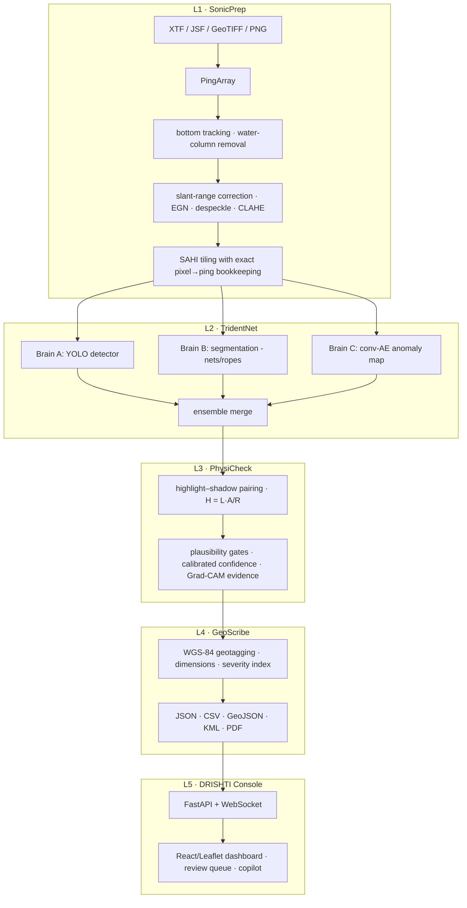

# SAGAR-NETRA 🌊👁️

**S**onar-based **A**utomated **G**eotagged **A**nomaly **R**ecognition — **N**avigable **E**vidence, **T**riage & **R**eporting **A**rchitecture

AI-powered automated underwater marine-debris and anomaly detection from side-scan sonar (SSS)
imagery. Built for **Smart India Hackathon 2026, PS 26057** (Ministry of Earth Sciences / NIOT).
Offline-first: everything runs on a laptop or Jetson-class edge device with zero cloud dependency.

## What it does

Raw SSS survey logs (XTF / EdgeTech JSF / GeoTIFF mosaics / plain waterfalls) go in one end;
calibrated, geotagged, physics-verified, prioritized contact reports come out the other — through
a live web dashboard with a map, waterfall viewer, evidence cards, and change detection.

## Architecture



## Quickstart

```bash
python -m venv .venv
.venv/Scripts/pip install -e .[dev]          # core; add [ml,geo,api] as needed
python scripts/make_sample_xtf.py            # deterministic bundled sample survey
pytest                                       # full test suite
```

The bundled sample (`data/samples/survey_alpha.xtf`) is a physics-consistent synthetic survey —
Rayleigh speckle, water-column gap, TVG banding, sand ripples, and eight seeded targets whose
acoustic shadows are ray-traced from their heights — regenerated byte-identically from a seed,
so nothing large lives in git. Ground truth ships alongside as JSON.

## Repository layout

| Path | Layer | Contents |
|---|---|---|
| `sonar_core/` | L1 | format parsers → `PingArray`, preprocessing, synthetic factory |
| `tridentnet/` | L2 | detector, segmenter, anomaly autoencoder, ensemble |
| `physicheck/` | L3 | shadow physics, calibration, evidence cards |
| `geoscribe/` | L4 | geotagging, severity index, report generation |
| `api/` + `web/` | L5 | FastAPI backend, React/Leaflet dashboard |
| `edge/` | — | ONNX export, TensorRT notes, benchmarks |

Engineering assumptions are logged milestone-by-milestone in [DECISIONS.md](DECISIONS.md).

## Status

- [x] **M1** — skeleton: parsers (XTF/JSF/image/GeoTIFF), `PingArray`, waterfall export, sample generator, tests
- [ ] **M2** — preprocessing: bottom tracking, slant correction, EGN, tiler
- [ ] **M3** — detector training + inference
- [ ] **M4** — shadow physics + calibrated confidence
- [ ] **M5** — geotagging + reports
- [ ] **M6** — dashboard
- [ ] **M7** — anomaly brain, change detection, copilot
- [ ] **M8** — edge export + polish
