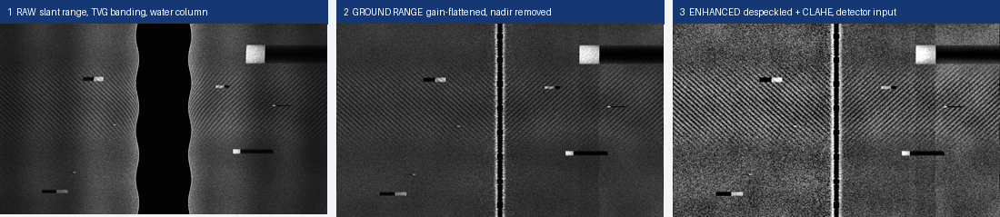
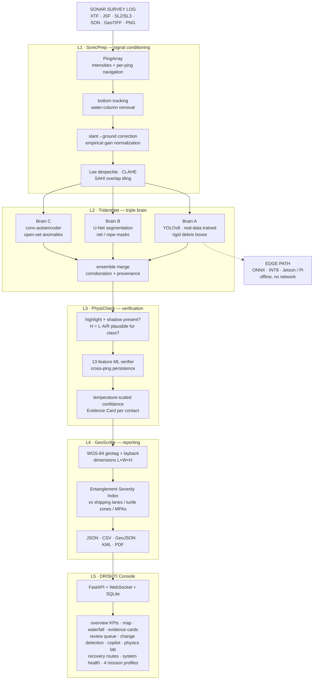
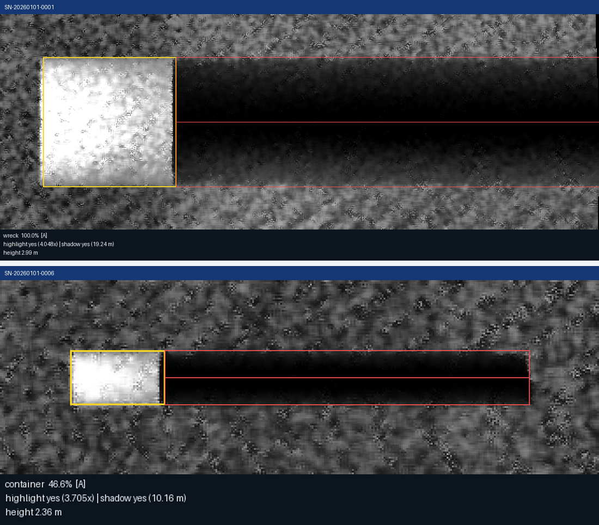
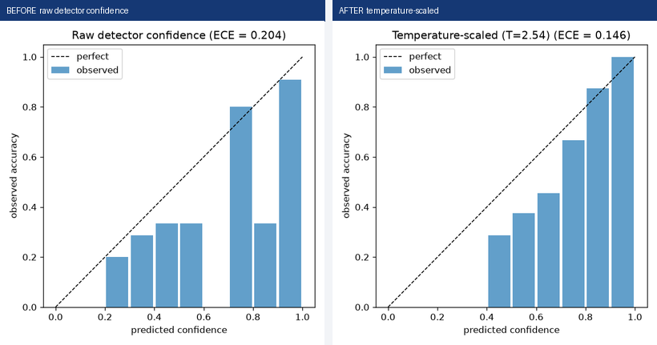
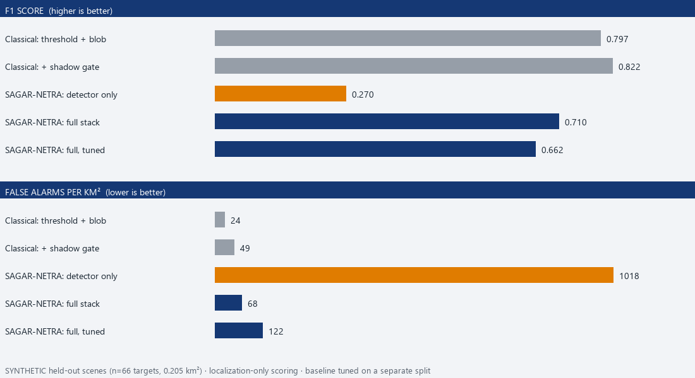
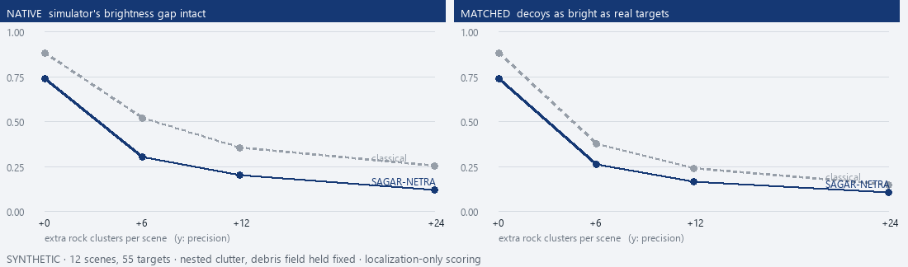
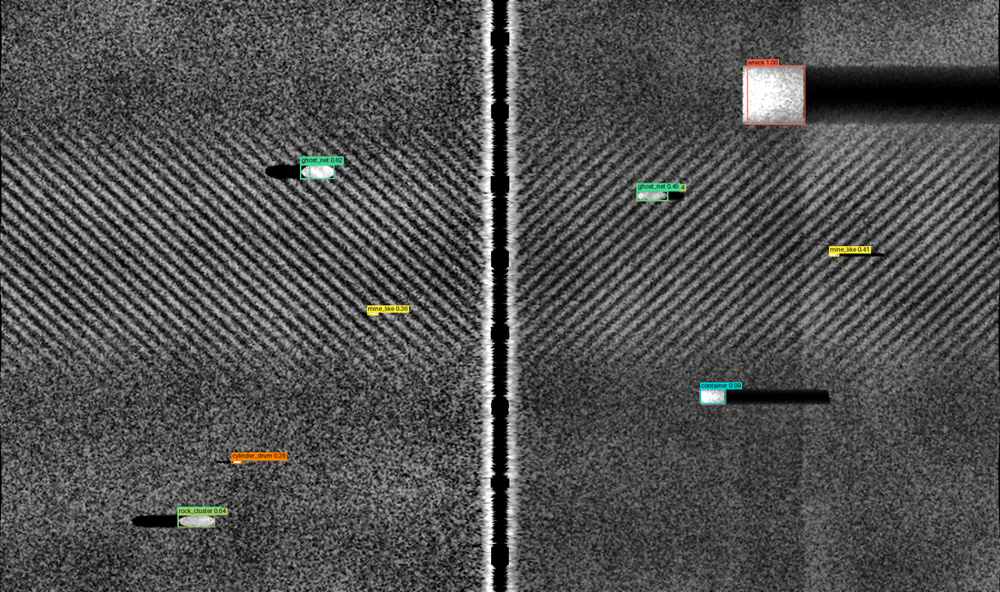
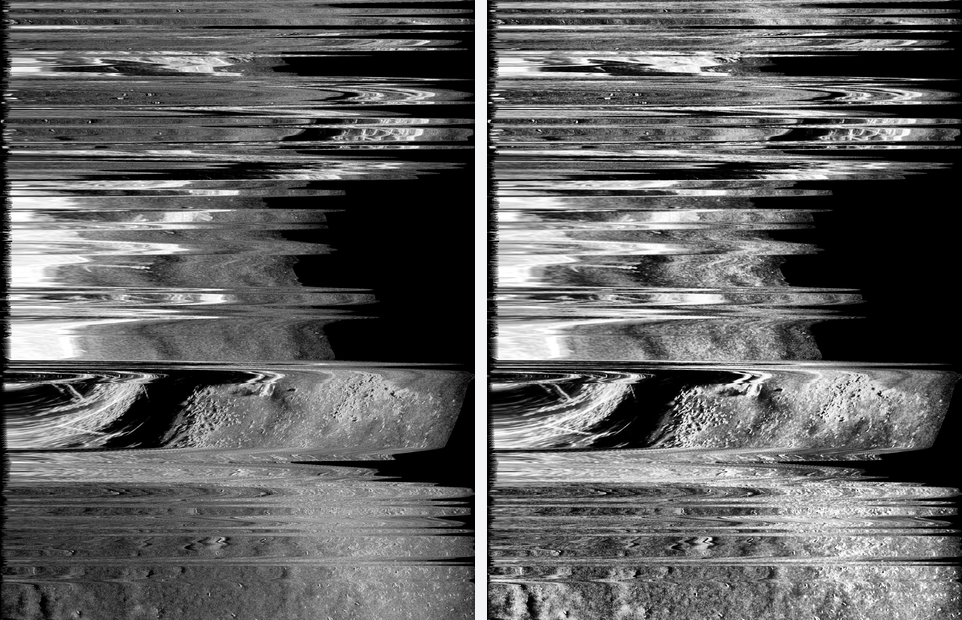

# SAGAR-NETRA · सागर नेत्र

**AI-Powered Automated Underwater Marine Debris & Anomaly Detection from Side-Scan Sonar**

Smart India Hackathon 2026 · Problem Statement **26057** · Ministry of Earth Sciences (MoES) / National Institute of Ocean Technology (NIOT) · Category: Software · Theme: Disaster Management

> Raw sonar survey logs go in one end. Calibrated, geotagged, **physics-verified**, priority-ranked
> debris reports come out the other — on a laptop, with no internet, in about ten seconds.

| | |
|---|---|
| **Status** | Complete prototype: 8 milestones + 12 hardening rounds; detector **retrained on real sonar** (UATD + KLSG); edge deployment path exported and verified |
| **Tests** | **374 passing**, 0 failures, `ruff` clean across 8 packages |
| **Detector** | mAP50 **0.819 on real annotated sonar boxes** (UATD val) · 0.808 synthetic · calibrated at T=1.05, ECE 0.073 |
| **Code** | 24,475 lines Python (12,749 library/API/edge · 5,281 scripts · 6,445 tests) · 8,091 lines frontend · 130 modules |
| **Cloud dependency** | **None.** Zero network calls at inference |
| **Input formats** | XTF · EdgeTech JSF · Lowrance SL2/SL3 · Humminbird DAT/SON · GeoTIFF · PNG/JPG |
| **Output formats** | JSON (+ JSON Schema) · CSV · GeoJSON · KML · PDF |

---

## 1. The problem

Between **500,000 and 1,000,000 tonnes** of ghost fishing gear enter the ocean every year. It
persists for **600–800 years**, makes up roughly **46%** of the Great Pacific Garbage Patch by
mass, and kills an estimated **650,000 marine animals annually**. A Kerala study measured
**167.5 kg of gear lost per vessel per year**; the Fishery Survey of India has mapped **14
ghost-gear hotspots** off the east coast alone, and India's **11,098 km** coastline is surveyed
by NIOT vessels and the OMe-6000 AUV that already generate side-scan sonar data.

**The bottleneck is not the sonar — it is the human review.** WWF's Baltic campaign surveyed
5,820 ha over 45 sea-days and produced 549 suspect contacts, each one hand-picked by an expert
scrolling waterfall imagery. Sonar search was already 12× faster and 17× cheaper than divers;
AI triage removes the last manual step.

**Market gap:** SonarWiz, Triton Perspective, Klein SonarPro and EdgeTech Discover ship **no AI
auto-detection**. SeeByte's ATR is naval, at defence pricing. GhostNetZero.ai is closed, cloud-only,
net-only and Baltic-trained — and is now expanding toward the Indian Ocean. There is no indigenous,
open, edge-deployable Indian system. This is that system.

---

## 2. What SAGAR-NETRA does



*Real output from the bundled survey: raw slant-range imagery (black water column, TVG banding)
→ ground-range corrected and gain-flattened → despeckled + CLAHE, the image the detector sees.*

The approach is four steps, and the second-to-last one is what makes it defensible:

| | **1 · CONDITION** | **2 · DETECT** | **3 · VERIFY** | **4 · ACT** |
|---|---|---|---|---|
| | raw log → clean imagery | triple-brain AI | physics + calibration | decision-ready output |
| | Bottom tracking · slant-range correction √(R²−A²) · empirical gain normalization · shadow-preserving despeckle · CLAHE · SAHI tiling | **YOLOv8 detector, real-data trained** (rigid debris) ∥ **U-Net masks** (ghost nets, ropes) ∥ **Autoencoder** (open-set unknowns) | Highlight–shadow pairing · height from shadow **H = L·A/R** · class plausibility gates · 13-feature ML verifier · cross-ping persistence · temperature-scaled 0–100% | WGS-84 geotag · entanglement severity index · clustered recovery routes · 5 report formats · live console |

**The core insight.** A side-scan sonar image is an *acoustic reflectance map*, not a photograph.
A real object proud of the seabed produces a **bright highlight paired with a dark shadow
extending down-range** — and the shadow is often more diagnostic than the object, because it
encodes silhouette and height. Every detection in SAGAR-NETRA must satisfy that geometry before
it reaches an operator. A "2-metre-tall bottle" is demoted with an explicit written reason,
not silently dropped.

---

## 3. Architecture



Five layers, each independently testable, each with its own config file and test suite.

---

## 4. Quickstart

```bash
python -m venv .venv
.venv/Scripts/pip install -e ".[dev,ml,api,geo]"
cd web && npm install && npm run build && cd ..   # dashboard (generated, not tracked)
.venv/Scripts/python scripts/make_sample_xtf.py   # deterministic bundled sample survey
.venv/Scripts/python scripts/demo.py --serve      # full pipeline, console at :8000
```

`web/dist` is a build artefact and is not committed, so the frontend step is required on
a fresh clone: without it the API serves but the console does not. `demo.py --serve` says
so rather than opening a blank page.

Or containerised: `docker compose up --build` (add `--profile postgis` for a shore station).

Or onto the edge — one archive, one script:

```bash
.venv/Scripts/python scripts/pack_edge.py         # -> dist/sagar-netra-edge.tar.gz (36 MB)
scp dist/sagar-netra-edge.tar.gz pi@<address>:~/
# then on the Pi (64-bit Raspberry Pi OS):
#   tar xzf sagar-netra-edge.tar.gz && cd sagar-netra && bash edge/setup_pi64.sh
```

The bundle carries the weights and the built console — neither is in git — with a SHA-256
manifest, and **refuses to build** if `detector.onnx` is older than `detector.pt`, since the
device would otherwise run a model the workstation already retired. `edge/setup_pi64.sh` asserts
`aarch64`, installs from piwheels, repoints Brain A at the ONNX export and runs four acceptance
checks; `edge/sagar-netra.service` makes it survive reboots.

### The 90-second judge demo

```bash
.venv/Scripts/python scripts/demo.py --serve
```

narrates the whole flow on the bundled survey and prints the contact table:

```
Done in 10.2 s: 1200 pings -> 18 tiles -> 17 raw detections -> 13 verified contacts

ID                   class           conf%   sev   H(m)  position
SN-20260101-0002     ghost_net        96.8  83.7    1.3  13.05016, 80.35064
SN-20260101-0005     ghost_net        61.9  80.7    0.7  13.04986, 80.35073
SN-20260101-0001     wreck           100.0  79.9    3.0  13.04976, 80.35035
SN-20260101-0004     aircraft         64.6  79.8    3.0  13.04975, 80.35035
SN-20260101-0007     container        50.8  77.3    2.4  13.04981, 80.35148
SN-20260101-0008     mine_like        38.9  73.1    0.2  13.05011, 80.35117
...
SN-20260101-0011     unknown_anomaly   11.5  62.7      -  13.05040, 80.35008
```

*(Output of the real-data-trained detector under honest calibration, T = 1.05 — the top
ghost net at 96.8% was 75.8% under the old synthetic-only model's stretched temperature.)*

Note the ranking: severity puts **ghost nets at the top even when their confidence is lower than
the wreck's** — because entanglement hazard, not detector certainty, is what a cleanup crew
prioritises. The last row is an open-set find with no class and no measurable shadow, surfaced by
the autoencoder rather than the detector.

…writes all five report formats (the KML opens directly in Google Earth), and opens the console
with the results loaded. Upload another survey from the dashboard — in **LIVE STREAM** mode you
watch detections arrive one by one over the WebSocket, as they would on a towed survey.

### Training from scratch (all offline; Brain A on GPU, Brains B/C and the verifier on CPU)

```bash
python scripts/train_detector.py --data data/datasets/real_mix/data.yaml   # Brain A as deployed
#   (build the mix first: download_datasets.py --get uatd/klsg, build_uatd_dataset.py,
#    build_klsg_dataset.py, build_real_mix.py; ~5 h on an RTX 4060 at workers=0.
#    Plain train_detector.py reproduces the synthetic-only baseline and OVERWRITES
#    the deployed real-data weights - back them up first.)
# Optional extra ensemble member. --dest is REQUIRED: without it the run
# defaults to weights/detector.pt and overwrites the deployed model.
python scripts/train_detector.py --data data/datasets/real_mix/data.yaml --seed 1 --dest weights/detector_seed1.pt --name detector_realmix_seed1
python scripts/train_segmenter.py --epochs 60        # Brain B  ~9 min
python scripts/train_anomaly.py                      # Brain C  ~10 min
python scripts/train_verifier.py --scenes 10         # Stage-2 verifier  ~2 min
python scripts/fit_calibration.py --apply            # temperature scaling
python scripts/eval_detector.py                      # the ablation table
```

The training scripts have a `--smoke` profile (tiny dataset, a few minutes) for CI; the
evaluation scripts shrink via `--scenes` instead.

---

## 5. Layer by layer — what is actually implemented

### The sonar physics, and where each relationship is used

Side-scan imagery is an acoustic reflectance map, not a photograph. Twelve relationships
govern what it can and cannot show, and each one below is *computed* somewhere in the
pipeline — the figures in the last column come from `configs/sonar.yaml`, not from prose.

| Physics | Relation | Implemented in |
|---|---|---|
| Waterfall formation | nadir at centre, port mirrored left | [`sonar_core/waterfall.py`](sonar_core/waterfall.py) |
| Range from time | `R = c·t/2` | [`parsers/jsf.py`](sonar_core/parsers/jsf.py) (from sampling interval + header sound speed); [`geometry.py`](sonar_core/geometry.py) |
| Slant → ground range | `G = √(R² − A²)` | [`preprocess/slant_range.py`](sonar_core/preprocess/slant_range.py), per-ping altitude |
| Water column | dead zone to first bottom return | [`preprocess/bottom_track.py`](sonar_core/preprocess/bottom_track.py) — tracked per ping, not assumed |
| TVG / gain banding | residual range-dependent gain | [`preprocess/egn.py`](sonar_core/preprocess/egn.py), empirical, nadir-guarded |
| Speckle statistics | multiplicative Rayleigh | [`preprocess/despeckle.py`](sonar_core/preprocess/despeckle.py) (Lee) + renderer |
| Acoustic shadow | `H = A·(x_end − x_far)/x_end` | [`physicheck/shadow.py`](physicheck/shadow.py) — the ground-domain form of `H = L·A/R` |
| Fan-beam geometry | 0.5° along, 50° across | [`configs/sonar.yaml`](configs/sonar.yaml) |
| Across-track resolution | `c·τ/2` — **constant with range** | `geometry.py` → **7.5 cm** |
| Along-track resolution | `θ·R` — **degrades with range** | `geometry.py` → **0.22 m @ 25 m, 0.65 m @ 75 m**; reported per contact as `dims.along_track_resolution_m` |
| Sound-speed error | 1% of `c` = 1% of every range | charged per contact in `position_accuracy` → **0.75 m at 75 m** |
| Multipath | 2nd bottom return at `A·√3` | `physicheck/verify.py` → `multipath_suspect` (advisory only — see §12) |

The two resolution limits are the ones that change how a report should be *read*:
across-track resolution never degrades, so the far swath edge is as sharp as nadir; but
along-track smear grows linearly, so a length measured at 75 m is three times softer than
the same length at 25 m. Every contact therefore carries the beam footprint that bounds
its own `length_m`.

**Not implemented, deliberately:** frequency-dependent absorption (`~f²`). EGN already
removes residual range-dependent gain *empirically from the data*, which beats subtracting
a modelled prediction. The frequency trade-off justifies the sensor choice; it is not a
pipeline computation, and adding a parameter nothing reads would be a magic number with a
physics-shaped excuse.

### L1 · SonicPrep — ingestion and signal conditioning

| Module | What it does |
|---|---|
| `parsers/base.py` | `PingArray` — the format-agnostic contract: `(n_pings, n_samples)` float32 per side, sample 0 at nadir, plus a 10-field `NAV_DTYPE` record per ping (time, lat, lon, heading, altitude, sensor depth, sound velocity, slant range, speed, layback) |
| `parsers/xtf.py` | Triton XTF via `pyxtf`; nav from per-ping headers, port/starboard resolved from `ChanInfo` |
| `parsers/jsf.py` | EdgeTech JSF message-type-80, implemented from the spec (offsets per MB-System's `mbsys_jstar.h`) |
| `parsers/lowrance.py` | **Citizen sonar**: Lowrance `.sl2`/`.sl3`, both frame layouts, spherical-mercator inverse, composite sidescan split at nadir |
| `parsers/humminbird.py` | **Citizen sonar**: Humminbird `.DAT` + `.SON`/`.IDX`, tag-walked records per PING-Mapper |
| `parsers/geotiff.py` | Georeferenced mosaics (optional `rasterio`); marks `ground_range` so slant stages are skipped |
| `parsers/image.py` | PNG/JPG with **operator-declared geometry** (altitude, range, position, heading; combined or single-channel layout) - unlocks slant correction, height-from-shadow and geotagging on images that record no navigation |
| `preprocess/bottom_track.py` | First-bottom-return detection with sustained-run thresholding, outlier rejection against a median-smoothed reference, header-altitude fallback |
| `preprocess/slant_range.py` | Ground range = √(R²−A²), per-ping altitude aware, **invertible to 6×10⁻¹² px**; nadir blend columns honestly NaN-masked |
| `preprocess/egn.py` | Empirical gain normalization; per-range medians with an 8-sample nadir guard band (without it, near-nadir gain inflated up to **2.2×**) — **19.8× flatness improvement** |
| `preprocess/despeckle.py` | Lee MMSE filter (NaN-safe normalised convolution) + adaptive median; **shadow edges move 0–0.4 px** |
| `preprocess/clahe.py` | 16-bit OpenCV CLAHE, NaN-swath safe |
| `preprocess/tiler.py` | SAHI-style overlapping tiles, shifted-last-tile edge policy, lossless coverage, exact tile→ping/column bookkeeping |
| `preprocess/pipeline.py` | Config-driven orchestrator with progress callbacks and per-stage timings |
| `waterfall.py` | Waterfall rendering with exact column ↔ (side, sample) mapping |

**Synthetic data factory** (`synth/`): a physics-consistent scene renderer — Rayleigh multiplicative
speckle, grazing-angle falloff, residual-TVG banding, sand-ripple fields, a water-column gap sized
by altitude, a bright first bottom return, and **ray-traced shadows whose length obeys the same
geometry PhysiCheck inverts**. Plus `shadow_render` (shadow compositing), `copy_paste`
(radiometry-matched chip pasting), `augment` (sonar-legal augmentations only), and `artifacts`
(the five artifacts the problem statement names: **heave banding, pitch stretch, roll shear, ping
dropout, resolution jitter**).

### L2 · TridentNet — the triple brain

The **12-class frozen label set** — 9 reportable object classes plus 3 *hard negatives* that exist
purely to absorb false positives and are never shown to an operator:

```
0 ghost_net   3 pipeline        6 container    9  rock_cluster ←hard negative
1 wreck       4 cylinder_drum   7 human_body   10 sand_ripple  ←hard negative
2 aircraft    5 tire            8 mine_like    11 reef         ←hard negative
```

plus `unknown_anomaly`, an ensemble-level open-set label (not a training class).

| Brain | Model | Role | Trained result |
|---|---|---|---|
| **A** | YOLOv8n, real-data trained (GPU) | Rigid debris — boxes | mAP50 **0.834** on the UATD+KLSG+synthetic mix; **0.819 on real annotated boxes** |
| **B** | U-Net, ~1.9 M params, pure torch | Ghost nets & ropes — pixel masks | val Dice **0.924** |
| **C** | Convolutional autoencoder | Open-set: "this does not belong here" | threshold auto-calibrated at train time |

**Why three brains.** A ghost net is a sprawling irregular tangle — a bounding box around it is
mostly water, so it gets segmentation. A drum is a compact ellipse — boxes are perfect, so
segmentation would be wasted compute. And an object class nobody trained on still has to surface,
so an autoencoder trained *only on clean seabed* flags reconstruction-error blobs as
`unknown_anomaly`. Most teams pick one architecture and force everything through it.

**Deep-ensemble uncertainty** (`deep_ensemble.py`): independently seeded detectors vote;
fused score = `sum(matched member scores) / n_models`, so unanimous agreement keeps the mean while
a lone find is cut proportionally. This replaces MC-dropout, which YOLOv8n cannot provide — it has
no dropout layers to sample. **Currently deployed single-member**: the old synthetic-only seeds
would veto exactly the real-sonar detections the retrain bought, so `configs/detector.yaml` lists
one member and documents the command to retrain seeds on the real mix before re-adding them.

**Ensemble merge** (`ensemble.py`): a Brain-C blob overlapping a Brain-A box at IoU ≥ 0.30
*corroborates* it (+0.05 score, provenance `AC`); Brain-B masks refine boxes to their true pixel
extent (provenance `AB`/`ABC`); standalone C blobs survive as open-set finds. Every contact
records which brains fired.

### L3 · PhysiCheck — verification and calibrated confidence



*Two real Evidence Cards. Yellow = the detection box, red = the measured acoustic shadow, caption =
the cues that fired. The wreck's 19.24 m shadow at 8 m altitude yields a 2.99 m height; the
container's 10.16 m shadow yields 2.36 m against a seeded truth of 2.4 m.*

- **`shadow.py`** — locates the shadow down-range of each box (dark-run detection over the central
  60% of box rows, because objects taper along-track), measures its ground-range length, and
  inverts the geometry to a height. Cues: highlight present, shadow present, ratios, length, height.
- **`calibrate.py`** — temperature scaling fitted by NLL on held-out scenes, expected calibration
  error, reliability diagrams, and a class-conditional plausibility gate driven by
  `configs/physics.yaml` (per-class height bands: tire ≤ 1.2 m, ghost net ≤ 2.5 m, wreck ≤ 15 m…).
- **`features.py` + `verifier.py`** — the **Stage-2 ML verifier**: a gradient-boosted classifier
  over **13 explicit physics features** — not a black box:

  | | | |
  |---|---|---|
  | `highlight_ratio` | `shadow_ratio` | `shadow_len_m` |
  | `height_m` | `has_height` | **`shadow_linearity`** — R² of a line through the shadow's trailing edge; pipes and hulls cast straight shadows, rocks cast ragged ones |
  | **`contour_regularity`** — man-made objects trend toward regular geometry | **`texture_entropy_delta`** — debris breaks the background texture statistics; sand ripples do not | **`ping_persistence`** — real objects persist across scan lines |
  | `aspect_ratio` | `area_px` · `range_frac` | `score_raw` |

  Trained **without the detector** — labels come from rendered truth geometry, negatives from rock
  clusters, ripple-band boxes and clear seabed, split by scene. Held-out **AUC 0.955, accuracy 0.957**.
- **`verify.py`** — applies the gate, the verifier multiplier and the cross-ping persistence gate.
  With no verifier checkpoint present, output is **bit-identical** to the Stage-1 pipeline (golden-tested).
- **`evidence.py`** — renders the Evidence Card PNG + a JSON cue list per contact (with optional
  gradient-free EigenCAM overlay).
- **`crossview.py`** — contacts seen in two overlapping surveys corroborate each other; lone
  contacts are demoted and flagged `resurvey_recommended`, mirroring naval re-acquire doctrine.



*Reliability diagrams before and after temperature scaling: **ECE 0.073** at T = 1.05 — the
real-data-trained detector is nearly calibrated out of the box (the synthetic-only one needed
T = 2.54 to get ECE down to 0.146).
A displayed "70%" now means roughly 70% of such detections are real.*

### L4 · GeoScribe — geotagging, severity and reports

- **Geotagging** — the towfish is placed at the ping's nav fix (pushed astern by layback), the
  target offset perpendicular to heading at its ground range, solved on the WGS-84 ellipsoid with
  pyproj. Verified against seeded scene geometry to within **6%**.
- **Dimensions** — length × width from the footprint (mask-refined for nets), **height from the
  shadow**. Measured container: 6.0 × 2.5 × 2.4 m against a seeded 6.1 × 2.4 × 2.4 m.
- **Position accuracy** — every contact carries an honest `position_accuracy_m` =
  `2 × ground_res + layback_term + nav_uncertainty + sound_speed_term`, the last being
  `sv_uncertainty_frac × ground_range_m` (1% of range = 0.75 m at 75 m, so it grows across the
  swath). Summed linearly because each term is a bias, not independent noise: a recovery diver
  wants the conservative number.
- **Entanglement Severity Index (0–100)** — a weighted, saturating blend, fully explainable
  because every contact carries its own breakdown:

  | Term | Weight | Detail |
  |---|---|---|
  | Class hazard | 0.40 | ghost_net 1.0, human_body 1.0, mine_like 0.95, container 0.80, drum 0.75, wreck/aircraft 0.60, pipeline 0.50, tire 0.30, unknown 0.65 |
  | Footprint area | 0.15 | saturating, 40 m² scale |
  | Height | 0.10 | saturating, 2 m scale |
  | Depth band | 0.15 | shallow objects entangle gear and strike hulls |
  | Layer proximity | 0.20 | geodesic distance to shipping lanes, turtle-nesting zones, MPAs (demo layers for the Chennai coast ship with the repo) |

- **Priority & recommended action** — HIGH ≥ 75, MEDIUM ≥ 50, else LOW, with an operator-facing
  action per class: *"Entanglement hazard — flag for ROV recovery"*, *"Notify SAR authority
  immediately"*, *"Do NOT approach — notify naval EOD"*.
- **Reports** — `contacts.json` (with a published JSON Schema), `contacts.csv`, `contacts.geojson`,
  severity-styled `contacts.kml`, and a branded `report.pdf` with per-contact thumbnails. Plus a
  survey summary block: contacts, high-confidence count, **area surveyed (km²)** and **debris
  density per km²**.
- **Recovery routing** — geodesic union-find clustering into recovery zones, then nearest-neighbour
  + 2-opt ordering within and across clusters.

### Physics Lab — the acoustics, made interactive

A console tab with three live models. Each one calls the **deployed backend** —
`sonar_core.geometry` and `physicheck.shadow` — rather than re-deriving the formulas in
JavaScript, so the lab and the pipeline cannot drift apart.

| Panel | What a visitor can do | Endpoint |
|---|---|---|
| **Height from shadow** | Drag altitude / height / range; watch the ray diagram redraw, the shadow forward-model, and the deployed estimator invert it back to the height it started from | `POST /api/physics/shadow` |
| **What the sonar can resolve** | Change beam width and pulse length; see across-track stay flat and along-track climb with range | `GET /api/physics/geometry` |
| **Build a seabed** | Place objects, render them through the real L1 chain, then measure each height back from its shadow against the truth the renderer used | `POST /api/physics/simulate` |

The shadow panel is the one to demo. At 10 m altitude a 2 m object throws a **5 m shadow
— a 2.5× lever**; raise it to 4 m and the shadow reaches 13.3 m, because the gain itself
grows with height. That is the entire argument for measuring the shadow instead of the
object, and a judge can drive it themselves.

The scene builder is honest by construction: the measured column is allowed to disagree
with the truth column, and the error is shown. On the shipped default scene it recovers
three objects to a **mean absolute height error of 0.10 m** — from shadow geometry alone,
with no model and no training.

### L5 · DRISHTI Console

A React 18 + Vite + Leaflet single-page console served by FastAPI, skinned as a **Government of
India / Ministry of Earth Sciences portal** (bilingual header with the Ashoka Chakra, tricolour
ribbon, working A- / A / A+ accessibility controls, skip-to-content link, navy nav and footer).
Design system committed at [`web/DESIGN.md`](web/DESIGN.md).

| Tab | What it does |
|---|---|
| **Overview** | Landing view: KPI tiles, severity distribution, class breakdown, priority action queue, physics evidence summary — served from the report's own summary block so console and reports cannot disagree. A survey ingested from a nav-less image raises a **DECLARED GEOMETRY** banner and a `NAV DECLARED-LINE` stamp: those positions are correct relative to the operator-declared line, and the console says so rather than passing them off as surveyed |
| **Map** | Contacts on satellite imagery, coloured by severity, with sensitive-zone GeoJSON overlays, a severity heatmap toggle, and auto-fit to wherever the survey actually is. Click-through Evidence Cards carry Confirm/Reject plus a free-text review note kept in the audit trail, and show the beam footprint (`along-track res ±`) and position budget bounding that contact |
| **Waterfall** | The processed sonar image with detection boxes registered pixel-exactly over it, zoom, raw/enhanced toggle, click a box → contact detail |
| **Contacts** | Dense ledger: thumbnail, class, confidence, severity swatch, L×W×H, depth, physics badges, review state, **recovery state**, and one-click download of all five report formats. Filterable by class, confidence and **review status** (pending / confirmed / rejected) for triage |
| **Recovery** | Retrieval-zone clustering and an optimised vessel tour with numbered waypoints and leg distances - the loop from sonar pixel to cleanup sortie |
| **Physics Lab** | Three interactive acoustics models (height-from-shadow, resolution limits, build-a-seabed simulator) - every slider calls the deployed backend physics, not a JS re-derivation |
| **Diff** | Change detection between two surveys — what is NEW since the last pass (the post-cyclone port-clearance feature) |
| **Copilot** | Natural language over the contact store: *"contacts longer than 5 m between 20 and 40 m depth"*, *"how many ghost nets?"*, *"contacts near the turtle nesting zone"*, plus auto-drafted survey summaries |
| **System** | Model registry with SHA-1 fingerprints per weights file, memory, throughput, the five-layer chain, offline posture |

Plus a persistent **ingest rail**: drag-and-drop upload, **BATCH or LIVE STREAM** mode, live
WebSocket progress, and a per-detection feed while streaming.

---

## 6. Measured results

Everything below was measured on this machine and is regenerable. Nothing is projected.

### Ablation — does each stage earn its place?

From [`docs/ablation.md`](docs/ablation.md), 8 held-out synthetic scenes
(seed base 12000, disjoint from training and calibration), 34 man-made truth boxes, 0.1023 km²,
one detection pass re-scored four ways:

| Configuration | Precision | Recall | F1 | PR-AUC | **FP / km²** |
|---|---|---|---|---|---|
| (a) raw detector | 0.270 | 0.588 | 0.370 | 0.514 | **527.9** |
| (b) + physics gate | 0.538 | 0.618 | 0.575 | 0.472 | **176.0** |
| (c) + ML verifier | 0.528 | 0.559 | 0.543 | 0.425 | **166.2** |
| (d) + temporal persistence *(deployed)* | 0.528 | 0.559 | 0.543 | 0.425 | **166.2** |

**False alarms per km² drop 3.2× at held recall.** (Measured with the real-data-trained
detector; the earlier synthetic-only stack showed 4.8× — the new detector proposes more
candidates on synthetic scenes, so the gate works harder for a slightly smaller ratio.)
Rows (c) and (d) coincide because no scored detection here was thinner than the persistence
minimum — the temporal gate is the backstop for exactly the single-model operation the stack
currently runs in.

> **Read honestly:** these are *synthetic* held-out scenes. Synthetic targets are easier than real
> debris in real clutter, so treat the absolute values as an upper bound and the **relative ladder**
> as the result. Real-data detector numbers now exist (section 11a: 0.819 mAP50 on real annotated
> boxes, and the right class reached on 359 of 385 real wreck images); a real-data ladder needs
> an annotated side-scan survey corpus.

### Against a classical baseline — an honest negative result

The ablation above measures SAGAR-NETRA against *itself*. It cannot answer the question a
reviewer asks first: **is any of this better than what survey teams already run?** So we built
the comparator — [`tridentnet/baseline.py`](tridentnet/baseline.py), a faithful reimplementation
of the threshold-and-blob CAD scheme that side-scan software used before learned detectors — and
scored it through the same matcher and the same metric code.

From [`docs/baseline_comparison.md`](docs/baseline_comparison.md): 16 held-out scenes, 66 truth
boxes, 0.205 km². Hyperparameters for **both** families are selected on a separate 8-scene tuning
split (seed base 11000) and applied unchanged. Scoring is localization-only, because a blob
detector emits no class and penalising it for that would be scoring a task it never attempts.

| Method | P | R | F1 | PR-AUC | FP/km² | Classifies? |
|---|---|---|---|---|---|---|
| Classical: threshold + blob | 0.904 | 0.712 | 0.797 | **0.917** | **24.3** | no |
| Classical: + shadow gate | 0.841 | 0.803 | **0.822** | 0.828 | 48.7 | no |
| SAGAR-NETRA: detector only, no physics | 0.171 | 0.652 | 0.270 | 0.569 | 1017.5 | yes |
| SAGAR-NETRA: full stack *(shipped 50% floor)* | 0.759 | 0.667 | 0.710 | 0.738 | 68.2 | yes |



**The tuned classical baseline beats the deployed stack at localization on this benchmark.** We
publish that rather than hide it. Three things are worth understanding about why.

**1. The benchmark is confounded, and we measured by how much.** In the scene simulator
`rock_cluster` — the only natural clutter class — has reflectivity **2.0–3.0**, the lowest of any
class, while most man-made targets sit at **4.0–8.0**. Brightness is therefore very nearly the
man-made/natural label, and a brightness threshold is handed the answer by the data generator.
Real sonar offers no such gap. [`docs/clutter_sweep.md`](docs/clutter_sweep.md) removes the
shortcut by giving decoy rocks the reflectivity of real targets, changing nothing else:



| Precision lost, +0 → +24 decoy rocks | Classical | SAGAR-NETRA |
|---|---|---|
| `native` — brightness gap intact | −0.630 | −0.618 |
| `matched` — gap removed | **−0.734** | **−0.632** |
| **Cost of removing the shortcut** | **−0.104** | **−0.014** |

Removing the shortcut costs the classical detector **7× more precision** than it costs us —
consistent with a method reading shape and shadow rather than amplitude. It explains part of the
baseline's lead. It does not erase it: classical still holds higher absolute precision at every
clutter level.

**2. One result in that table is immune to the confound**, because both rows score *identical*
detections from the same detector: the physics and verifier stages take false alarms from
**1018 to 68 per km² — a 15× cut** — at comparable recall. That is the ablation result, and it
stands whatever the baseline does.

Rows (1) and (2) are *not* a shadow-gate ablation — each variant is tuned independently and they
land on different `k_sigma`. Ablated properly, with only the gate changing, the shadow
requirement raises precision **where detection is hard** (+0.13 at k=1, +0.23 at k=3) but costs
recall, and at the permissive thresholds this baseline prefers it is net-negative on F1
(0.909 → 0.848 at k=0.25). The cue is real but conditional; we do not claim it as a free win.

**3. What the baseline cannot do at any threshold** is the `Classifies?` column. It localizes.
It cannot name a class, invert shadow length into height, score severity against habitat and
shipping layers, or populate a report. That gap is architectural, not a matter of tuning.

The likeliest reason the learned stack did not pull ahead is that a clean simulated seabed of
high-contrast targets is exactly the regime a tuned threshold is best at — compounded, at the
time of this comparison, by a detector trained on 172 synthetic tiles (that detector has since
been retrained on real data, section 11a; this table predates the retrain and is kept as
published rather than re-run, because the confound it documents is about the *benchmark*, not
the model).

### Throughput ([`edge/benchmark.md`](edge/benchmark.md), CPU only)

| Stage | ms / tile | Throughput |
|---|---|---|
| L1 preprocessing | — | **2,822 pings/s** (800-ping survey in 0.28 s) |
| Detector — PyTorch CPU | 64.7 | 15.45 tiles/s |
| Detector — **ONNX Runtime CPU** | **29.9** | **33.44 tiles/s** |
| Detector — ONNX INT8 CPU | 292.3 | 3.42 tiles/s *(see note)* |
| Anomaly autoencoder | 35.3 | 28.35 tiles/s |

A side-scan sonar produces 1–10 ping lines per second. The pipeline runs far ahead of the sensor.

> **INT8 note, stated honestly:** dynamic quantisation shrinks the model from **12.7 MB → 3.8 MB**
> (the sub-10 MB edge target is met, and INT8 holds mAP50 0.809) but runs *slower* on this x86 laptop, which has no VNNI int8
> convolution path. The INT8 speed claim belongs to Jetson TensorRT, on hardware we do not have.
> The benchmark says so rather than hiding it.

### Models and verification

**Detector accuracy, per domain.** "Accuracy" for a detector is not one number, so
here is the whole picture — from [`docs/real_training.md`](docs/real_training.md), where the
retrained candidate and the previous synthetic-only model were measured through one harness
in one run:

| Validation set | Label quality | Before (synthetic-only) | **After (real-data trained)** |
|---|---|---|---|
| **UATD** — real sonar | **human-annotated boxes** | 0.002 | **mAP50 0.819** |
| KLSG — real side-scan | weak (measured extents) | 0.007 | mAP50 0.637 |
| synth_xl — simulated | exact renderer truth | 0.701 | **mAP50 0.808** *(improved, not traded)* |
| Mixed val (905 images, best epoch) | — | — | **mAP50 0.834** |

At the final epoch on the mixed set: **precision 0.802, recall 0.809, mAP50-95 0.485**. The
strict mAP50-95 is normal for small targets in sonar, where a few pixels of box slack costs a
lot of IoU.

**System-level accuracy**, which is what an operator actually experiences:

| Measure | Before | After |
|---|---|---|
| KLSG val chips getting the right class (top-1) | 11.4% | **98.9%** (87/88) |
| Full pipeline reaching `wreck`/`aircraft` on 385 real wreck images | 53/385 (13.8%) | **359/385 (93.2%)** |

**Everything else, measured:**

| Item | Result |
|---|---|
| Training data | 7,838 train images (92% real sonar: 6,895 UATD + 352 KLSG + 591 synthetic) carrying **11,596 real annotated boxes**; 12,616 across train+val |
| Training run | YOLOv8n, 60 epochs, imgsz 640, batch 16, RTX 4060, **4.9 h** (dataloader-bound at `workers=0`) |
| Brain B segmenter (60 epochs) | val Dice **0.924**; mask alignment verified to **0.02 px** |
| Brain C anomaly autoencoder | threshold auto-calibrated at train time (0.176 on the shipped checkpoint) |
| Stage-2 verifier | held-out AUC **0.955**, accuracy **0.957**, 13 explicit physics features |
| Confidence calibration | **ECE 0.073** at T = 1.05 — a displayed "70%" means ~70% of such contacts are real |
| ONNX export parity | mAP50 delta **0.0000** vs PyTorch (dynamic batch, 905-image val) |
| INT8 quantised | mAP50 **0.809** at **3.8 MB** (from 12.7 MB) |
| Height from shadow | seeded 2.0 m recovered within 25%; 2.4 m container measured at 2.36 m |
| Geotag accuracy | within **6%** of seeded across-track offset |
| Slant↔ground round-trip | **6×10⁻¹² px** |
| End-to-end demo (full triple-brain + verifier) | 1200 pings → 18 tiles → 17 raw detections → **13 contacts + 5 reports in ~10 s** |

> **Where these numbers stop.** UATD is *multibeam forward-looking* sonar, so mAP50 0.819
> demonstrates competence on **real acoustics**, not on side-scan geometry specifically. The
> side-scan evidence is the 93.2% class-reach, which is against folder-level truth rather than
> boxes. A true side-scan mAP needs an annotated side-scan corpus — which is exactly what the
> console's review loop collects.



*Detector output on the bundled survey — every seeded target localised, each with its
highlight–shadow signature intact.*

---

## 7. The twelve innovations

Mapped to the design blueprint; full per-feature audit in [`COMPLIANCE.md`](COMPLIANCE.md)
(**45 implemented · 5 partial · 3 documented non-goals** across 53 audited features).

| # | Innovation | Status |
|---|---|---|
| N-01 | **Open-set triple brain** — detector + net segmentation + unknown-anomaly autoencoder | All three trained and fused |
| N-02 | **PhysiCheck engine** — highlight–shadow pairing and H = L·A/R as a false-positive firewall | Implemented, ablation-measured |
| N-03 | **Calibrated Evidence Cards** — ensemble + temperature scaling + per-detection cue list | Implemented |
| N-04 | **Synthetic Data Factory** — physics-consistent generation with sim-to-real path | Physics renderer + copy-paste + artifact augs; diffusion/CycleGAN documented as growth path |
| N-05 | **Entanglement Severity Index** — class × size × height × depth × habitat proximity | Implemented with explainable breakdown |
| N-06 | **Retrieval Mission Planner** — density clustering + optimised vessel routing | Implemented |
| N-07 | **Temporal change detection** — "new anomaly since last pass" | Implemented (`/api/diff`) |
| N-08 | **Active-learning flywheel** — analyst verdicts become training labels | Implemented (`scripts/export_review_labels.py`) |
| N-09 | **Edge-first, offline-first** — ONNX/INT8, zero cloud | Implemented + measured |
| N-10 | **Citizen sonar** — Lowrance & Humminbird recreational sonar ingestion | Implemented, dashboard-uploadable |
| N-11 | **SONAR-GPT copilot** — natural-language querying + survey summaries | Implemented, works fully offline |
| N-12 | **Disaster-mode profiles** — one pipeline, four missions | Implemented |

### Four missions, one pipeline

A mission profile re-weights the severity hazard table and the detector confidence floor — it
**re-ranks, it never re-detects**, so imagery and physics evidence stay comparable across missions.

| Mission | Confidence floor | Emphasis |
|---|---|---|
| `ghost_net_cleanup` | 0.20 | Ghost gear and entanglement hazards |
| `port_clearance` | 0.25 | Containers, wrecks, pipelines — post-cyclone harbour clearance |
| `sar` | **0.10** (recall first) | Human body — search and rescue |
| `aircraft_search` | 0.15 | Aircraft, wreckage — black-box search |

---

## 8. Data strategy

**Training is real-first, synthetic-supported.** The deployed detector is trained on
`data/datasets/real_mix` — 6,895 real UATD training images with 11,596 human-annotated boxes
(12,616 across train and val; CC BY 4.0)
plus 352 real KLSG side-scan chips with measured weak labels, blended with 591 synthetic chips.
The synthetic factory remains the source for the segmenter, the anomaly brain and the physics
verifier: it renders physically correct imagery through the *same* preprocessing chain used at
inference, and ghost nets get 3× sampling weight as the rarest and hardest class.

**Augmentation obeys sonar physics.** Mirroring across columns, rotation, shear and perspective are
*forbidden* — they would place acoustic shadows up-range of their highlights, geometry no sonar can
produce. Isotropic scaling, translation and along-track flips are valid. The rule is pinned
explicitly in the training script so an upstream default change cannot silently violate it.

**The real-data path is scripted, licensed — and executed.** `python scripts/download_datasets.py --list`
prints the table of eight: Marine Debris FLS · UATD · SCTD · Seabed Objects-KLSG ·
AI4Shipwrecks · SWDD · Marine PULSE · UXO — each with its license and role. UATD and KLSG have been downloaded,
converted (`build_uatd_dataset.py`, `build_klsg_dataset.py`, `build_real_mix.py`) and trained on;
UATD's `Test_2` split is reserved untouched as a final holdout. The active-learning flywheel adds
side-scan-specific labels from every analyst review.

**The bundled sample** (`data/samples/survey_alpha.xtf`, 5.1 MB, committed and byte-reproducible
from its seed) is a real XTF file containing 1200 pings and **8 seeded targets** with published
ground truth — 6 man-made plus 2 rock clusters as natural distractors, spanning 12.5–33 m ground
range at 8 m altitude.

---

## 9. API reference

| Method | Endpoint | Purpose |
|---|---|---|
| `GET` | `/api/health` | Model versions (SHA-1 per checkpoint), load state, memory, last-survey throughput |
| `POST` | `/api/upload` | Upload a survey — `mode=batch\|stream`, optional `mission=`; nav-less images add `layout=combined\|single` + declared geometry (`altitude_m`, `range_m`, `lat`, `lon`, `heading_deg`, `sensor_depth_m`) |
| `GET` | `/api/jobs` · `/api/jobs/{id}` | Job list / one job snapshot |
| `WS` | `/api/jobs/{id}/progress` | Live progress; in stream mode, per-detection events |
| `GET` | `/api/surveys` | Processed surveys |
| `DELETE` | `/api/surveys/{name}` | Remove a survey and its contacts (console hygiene; report files on disk are kept) |
| `GET` | `/api/contacts` | Filter by `survey`, `cls`, `min_conf`, `min_sev`, `review`, `limit` |
| `GET` | `/api/contacts/{id}` | One contact, full record |
| `POST` | `/api/contacts/{id}/review` | Confirm / reject (feeds the retraining flywheel) |
| `POST` | `/api/contacts/{id}/recovery` | `flagged → assigned → retrieved` |
| `GET` | `/api/contacts/{id}/evidence` · `/thumb` | Evidence Card PNG · thumbnail |
| `GET` | `/api/reviews/export` · `/api/recovery/log` | Append-only audit trails |
| `GET` | `/api/report/{json\|csv\|geojson\|kml\|pdf}?survey=` | Download a report |
| `GET` | `/api/waterfall/{survey}` · `/meta` | Processed imagery + overlay geometry |
| `GET` | `/api/diff?survey_a=&survey_b=&radius_m=` | Change detection |
| `GET` | `/api/crossview?survey_a=&survey_b=` | Cross-survey confirmation, resurvey flags |
| `GET` | `/api/route?cluster_eps_m=` | Recovery tour over confirmed contacts |
| `GET` | `/api/summary?survey=` | The report's own summary block (coverage, density, severity mix) |
| `GET`/`POST` | `/api/physics/{geometry\|shadow\|classes\|simulate}` | Physics Lab: resolution/multipath geometry, shadow forward+inverse model, scene simulator — all computed by the deployed physics code |
| `POST` | `/api/copilot` | Natural-language question → answer + SQL + rows |
| `GET` | `/api/missions` · `/api/layers` | Mission profiles · sensitive-zone GeoJSON |
| `GET` | `/tiles/{z}/{x}/{y}.png` | Basemap proxy with a per-source disk cache (online once, offline forever) |

---

## 10. Repository layout

| Path | Layer | Contents |
|---|---|---|
| `sonar_core/` | L1 | 6 format parsers → `PingArray`, 7-stage preprocessing pipeline, synthetic scene factory |
| `tridentnet/` | L2 | Detector + deep ensemble, U-Net segmenter, anomaly autoencoder, brain merger, dataset builder |
| `physicheck/` | L3 | Shadow geometry, calibration, 13-feature verifier, Evidence Cards, cross-view |
| `geoscribe/` | L4 | Contact model, geotagging, severity index, 5 report writers, clustering + routing |
| `api/` | L5 | FastAPI app, SQLite store, batch + streaming processing, diff, copilot |
| `web/` | L5 | React/Vite/Leaflet console + committed design system |
| `edge/` | — | ONNX + INT8 export with parity checks (dynamic batch), benchmarks, a 64-bit Pi bring-up script + systemd unit, runbooks: Raspberry Pi 5, Hailo AI HAT, Jetson TensorRT |
| `configs/` | — | 7 YAML files + 4 mission profiles — every tunable, commented, with units |
| `scripts/` | — | 21 CLIs: training, calibration, evaluation, export, demo, dataset download, real-dataset builders, edge packaging |
| `tests/` | — | 43 files, **374 tests** |
| `docs/` | — | Analysis reports (ablation, baseline comparison, clutter sweep, real data, real training) + README figures |

**Documentation index**

| File | Contents |
|---|---|
| [`COMPLIANCE.md`](COMPLIANCE.md) | Feature-by-feature audit against the design blueprint, with evidence |
| [`DECISIONS.md`](DECISIONS.md) | **88 engineering decisions** across 7 milestones and 10+ hardening rounds — every assumption, with its reason |
| [`docs/ablation.md`](docs/ablation.md) | The ablation ladder and its protocol |
| [`docs/real_training.md`](docs/real_training.md) | Real-data retrain: acceptance gates, before/after |
| [`docs/real_data.md`](docs/real_data.md) | The pipeline on 447 real sonar images, honestly |
| [`docs/baseline_comparison.md`](docs/baseline_comparison.md) | Head-to-head vs a tuned classical CAD baseline |
| [`docs/clutter_sweep.md`](docs/clutter_sweep.md) | The simulator confound, quantified |
| [`edge/raspberry_pi.md`](edge/raspberry_pi.md) | Pi 5 full-stack bring-up (CPU-first) |
| [`edge/hailo.md`](edge/hailo.md) | AI HAT: ONNX → HEF compilation runbook |
| [`edge/benchmark.md`](edge/benchmark.md) | Machine-stamped throughput measurements |
| [`edge/trt_int8.md`](edge/trt_int8.md) | Jetson INT8 conversion runbook + calibration-set generator |
| [`web/DESIGN.md`](web/DESIGN.md) | The console's design system |

---

## 11. Engineering quality

- **374 tests, zero failures** — unit tests per module plus end-to-end acceptance tests per
  milestone, including a full raw-XTF → reports run.
- **`ruff` clean** across all 8 packages (E, F, W, I, N, UP, B).
- **Every stage config-driven** — no magic numbers in code; defaults live in one place and the YAML
  mirrors them.
- **Adversarially reviewed.** Each build round ended with review agents that probed the new code
  empirically and reported only substantiated defects. Over **20 real bugs** were found and fixed
  with regression tests, including: EGN inflating near-nadir gain 2.2×, streaming dedup storing
  boundary-clipped fragments instead of full re-detections, a copilot query hijack (`"lane"`
  matching inside `"planes"`), a mission-name path traversal, and an SL2 timestamp overflow.
- **Graceful degradation everywhere**: no GPU → CPU; no trained weights → documented fallback with
  a warning; no LLM → rule-based copilot; no internet → cached tiles, then a neutral sea-grid tile.

---

## 11a. First contact with real sonar



*Real KLSG shipwreck imagery as supplied (left) and after the L1 chain (right). The
highlight-and-shadow structure the physics gate keys on is unmistakable in real data.*

The pipeline has now been run over **447 real side-scan images** — 385 shipwrecks and 62
aircraft from L-3 Klein Associates, EdgeTech, Lcocean, Hydro-tech Marine and Tritech
(KLSG, academic use). Full report: [`docs/real_data.md`](docs/real_data.md).

**What transfers:** all 447 parse and run the complete signal chain — bottom tracking,
slant correction, despeckle, CLAHE, tiling — with no per-format handling and no crashes.

**The detector was then retrained on real data** — 7,838 images (92% real sonar; 88% UATD:
UATD's 12,616 human-annotated boxes plus KLSG chips), 60 GPU epochs. Before/after on
this same corpus, same harness ([`docs/real_training.md`](docs/real_training.md)):

| measure | synthetic-only detector | real-data-trained |
|---|---|---|
| wreck images reaching `wreck`/`aircraft` (full pipeline) | 53 / 385 (13.8%) | **359 / 385 (93.2%)** |
| KLSG val chips, top-1 correct class | 11.4% | **98.9%** |
| mAP50 on real annotated boxes (UATD val) | 0.002 | **0.819** |
| synthetic val (regression check) | 0.701 | **0.808** — improved, not traded |

Brain C still floods on busy real seabed (82.9% of raw detections; two candidate fixes
were measured and rejected — `docs/real_data.md` has both), so the physics gate remains
what makes the output usable. The claim, updated honestly:

> The **signal chain** works on real sonar from five manufacturers, and the **detector**
> is now trained on real acoustics — mAP50 0.819 against real human-drawn boxes. The
> remaining gap is domain (forward-looking training data vs side-scan deployment) and the
> open-set brain, both measured.

---

## 12. Honest limitations

Stated plainly, because a prototype that hides its edges is not trustworthy:

1. **The detector's real training data is mostly forward-looking sonar.** UATD (88% of the mix)
   was collected with a multibeam forward-looking sonar, not a side-scan towfish — mAP50 0.819 on
   its real boxes proves real-acoustics competence, not side-scan-specific competence. The KLSG
   side-scan numbers (98.9% class-reach) are against weak measured boxes. True side-scan mAP
   needs an annotated side-scan corpus, which is exactly what the console's review loop collects.
2. **A tuned classical CAD baseline outperforms us on the synthetic benchmark** — F1 0.822 vs
   0.710, localization-only. It is published in section 6 rather than hidden. Part of the gap is
   a simulator confound we quantified (`docs/clutter_sweep.md`); part is a small CPU-trained
   detector (since retrained on real data — the comparison predates the retrain and is kept as
   published). *"SAGAR-NETRA beats classical sonar software"* is **not** a claim this repository
   supports.
3. **INT8 is a size win here, not a speed win** — the speed claim needs Jetson TensorRT hardware.
4. **Accelerator paths are documented runbooks, not yet executed measurements.** The Raspberry
   Pi 5 + Hailo AI HAT bring-up is in [`edge/raspberry_pi.md`](edge/raspberry_pi.md) (full stack
   on CPU — runnable today) and [`edge/hailo.md`](edge/hailo.md) (HEF compilation; the Hailo
   Dataflow Compiler needs x86-64 Linux). Jetson/TensorRT is [`edge/trt_int8.md`](edge/trt_int8.md).
   The exported models themselves are measured on x86 CPU (ONNX parity delta 0.0000; INT8 mAP50
   0.809 at 3.8 MB); on-accelerator throughput stays "not yet measured" until it is.
5. **The State Emblem is not used** (it is legally restricted). The header renders an Ashoka Chakra,
   with a marked slot for an official asset if the submission is entitled to one.
6. **Sensitive-zone layers are illustrative demo geometry** for the Chennai coast, clearly labelled
   as such — not official maritime boundaries.
7. **Not an official Government of India website** — the console states this in its footer.
8. **The multipath flag's precision is unvalidated.** The geometry is right and tested — a second
   bottom return lands at `A·√3` — but the scene simulator renders no multipath, so on synthetic
   data every flag is a false positive by construction (3 of 13 on the sample survey). It is
   advisory only: it never lowers a confidence, and a test pins that inertness by widening the
   band from "nothing" to "almost everything" and asserting confidences stay bit-identical. Read
   it as "check this", never "this is multipath"; assessing its precision needs real survey data.
9. **Deliberate non-goals**, each with a written rationale in `DECISIONS.md`: OpenMax fusion
   (Brain C + consensus covers open-set), MC-dropout (YOLOv8n has no dropout layers), and
   diffusion/CycleGAN synthesis (needs GPUs and real style targets).

---

## 13. Credits and licensing

Code: MIT (see [`LICENSE`](LICENSE)). Ultralytics YOLOv8 is AGPL-3.0 — relevant if the trained
detector is redistributed.

Public datasets referenced by `scripts/download_datasets.py` carry their own licenses (CC BY-NC-SA,
CC-BY, BSD-3) and are attributed in the table it prints. The shipped detector weights are trained
on **UATD** (CC BY 4.0 — cite Xie et al.) and **KLSG** (images contributed by L-3 Klein Associates,
EdgeTech, Lcocean, Hydro-tech Marine and Tritech; released for academic use — this build must not
be commercialised without replacing that data). Basemap imagery: Esri World Imagery
(Maxar, Earthstar Geographics, GIS community), proxied and cached locally.

Built for **Smart India Hackathon 2026**, Problem Statement **26057**, Ministry of Earth Sciences /
National Institute of Ocean Technology.

---

<div align="center">

**सागर नेत्र** — *the eye of the ocean*

</div>
