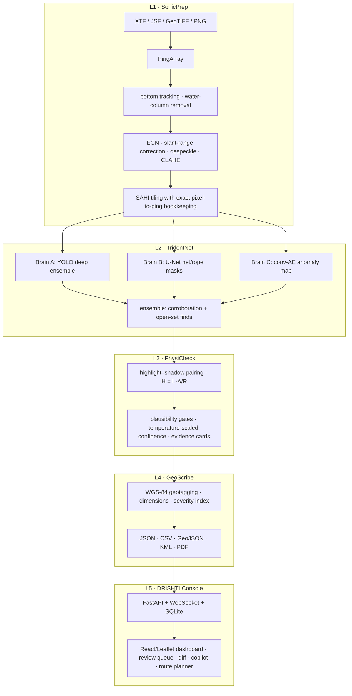

# SAGAR-NETRA 🌊👁️

**S**onar-based **A**utomated **G**eotagged **A**nomaly **R**ecognition — **N**avigable **E**vidence, **T**riage & **R**eporting **A**rchitecture

AI-powered automated underwater marine-debris and anomaly detection from side-scan sonar (SSS)
imagery. Built for **Smart India Hackathon 2026, PS 26057** (Ministry of Earth Sciences / NIOT),
theme Disaster Management. **Offline-first**: everything runs on a laptop or Jetson-class edge
device with zero cloud dependency.

Raw SSS survey logs (XTF / EdgeTech JSF / Lowrance .sl2/.sl3 / Humminbird .DAT+.SON / GeoTIFF
mosaics / plain waterfalls) go in one end; calibrated, geotagged, physics-verified, prioritized
contact reports come out the other — through a live web dashboard with a map, waterfall viewer,
evidence cards, change detection, cross-survey confirmation, clustered recovery routes, four
switchable disaster-mode mission profiles, and a natural-language copilot that also drafts
survey summaries. Feature-by-feature verification against the design blueprint lives in
[COMPLIANCE.md](COMPLIANCE.md).

## Architecture



## Quickstart

```bash
python -m venv .venv
.venv/Scripts/pip install -e .[dev,ml,api,geo]
python scripts/make_sample_xtf.py        # deterministic bundled sample survey
python scripts/train_detector.py --smoke # verify training mechanics (<1 min CPU)
python scripts/train_detector.py         # real synthetic training (~15 min CPU)
python scripts/train_anomaly.py          # Brain C (~10 min CPU)
python scripts/demo.py --serve           # full pipeline + dashboard at :8000
```

Or `docker compose up --build` for the containerized console
(`--profile postgis` adds a PostGIS for shore stations).

### The 5-minute demo

```bash
python scripts/demo.py --serve
```

narrates the full flow on the bundled survey — parse → preprocess → TridentNet → PhysiCheck →
GeoScribe — prints the contact table, writes all five report formats (the KML drops straight into
Google Earth), and opens the DRISHTI console with the results loaded: upload another survey from
the dashboard and watch detections stream in live.

## What makes it defensible

- **Physics in the loop, not vibes.** Every detection is verified against sonar acoustics: a real
  proud object needs a highlight *and* a down-range shadow; height comes from shadow geometry
  (H = L·A/R) and implausible class/height combinations are demoted with an explicit reason shown
  on the evidence card. Detections are demoted, never silently deleted.
- **Calibrated confidence.** Raw detector scores are temperature-scaled on a held-out validation
  set (fitted T and reliability diagrams in `outputs/calibration/`), then multiplied by the
  physics gate — the 0–100% shown to operators means what it says.
- **Open-set safety net.** Brain C (a conv-autoencoder trained only on clean seabed) flags
  anything unusual as `unknown_anomaly`, so debris classes the detector was never trained on
  still surface.
- **Exact provenance.** Any reported pixel maps back through tile → ground-range column → slant
  sample → ping NAV record (round-trip verified to sub-pixel), so every contact's WGS-84 fix is
  auditable.
- **Honest offline training.** With no internet, models train on a physics-consistent synthetic
  factory (speckle, TVG residual, ray-traced shadows); scripts for eight public real datasets
  (with licenses) are the documented path to field weights. See [DECISIONS.md](DECISIONS.md).

## Measured performance (this laptop, CPU only)

| Stage | Metric | Value |
|---|---|---|
| L1 preprocessing | throughput | 2233 pings/s |
| Detector (YOLOv8n @512, PyTorch CPU) | raw forward | 17.7 tiles/s |
| Detector (ONNX Runtime CPU) | raw forward | 43.2 tiles/s |
| Detector, full predict incl. NMS | end-to-end | 5.6 tiles/s |
| Detector (30 epochs synthetic) | val mAP50 | 0.653 |
| ONNX export parity | mAP50 delta vs PyTorch | 0.0000 |
| Anomaly autoencoder (CPU) | error maps | 21 tiles/s |
| Calibration | ECE before → after | 0.204 → 0.146 (T = 2.54) |
| Bundled demo end-to-end | raw XTF → 10 contacts + 5 reports | 10.2 s |
| Bundled demo recall | 8 seeded targets | all 8 localized (2 rock clusters confused; absorbed/flagged by design) |

Regenerate with `python edge/benchmark.py` (writes `edge/benchmark.md`);
`edge/export_onnx.py` exports ONNX with raw + mAP parity checks and
`edge/trt_int8.md` documents the Jetson INT8 path.

## Repository layout

| Path | Layer | Contents |
|---|---|---|
| `sonar_core/` | L1 | format parsers → `PingArray`, preprocessing pipeline, synthetic factory |
| `tridentnet/` | L2 | detector, anomaly autoencoder, ensemble, dataset builder |
| `physicheck/` | L3 | shadow physics, calibration, evidence cards |
| `geoscribe/` | L4 | geotagging, severity, contacts, reports, route planner |
| `api/` + `web/` | L5 | FastAPI backend, React/Leaflet dashboard |
| `edge/` | — | ONNX export, TensorRT runbook, benchmarks |
| `configs/` | — | every tunable, commented, one YAML per subsystem |
| `tests/` | — | 140+ tests incl. per-milestone e2e acceptance |

## Status

- [x] **M1** — skeleton: parsers (XTF/JSF/image/GeoTIFF), `PingArray`, waterfall export
- [x] **M2** — preprocessing: bottom tracking, EGN, slant correction, despeckle, CLAHE, tiler
- [x] **M3** — detector: synthetic dataset, training, inference >5 tiles/s CPU
- [x] **M4** — physics: shadow height, plausibility gates, calibrated scores, evidence cards
- [x] **M5** — geo & reports: WGS-84, severity index, JSON/CSV/GeoJSON/KML/PDF
- [x] **M6** — dashboard: live upload→detect→map flow, review queue, waterfall overlay
- [x] **M7** — intelligence: anomaly brain, change detection, copilot, heatmap, route planner
- [x] **M8** — edge & polish: ONNX export + parity, benchmarks, docker, demo script

Dataset attribution and licenses: `python scripts/download_datasets.py --list`.
